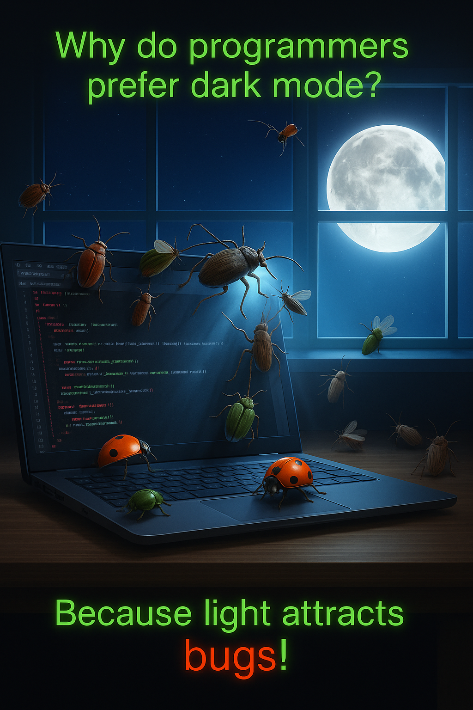

# 👋 Terve! 

# Olen Ron Gustafsson

🧑‍💻 ICT-alan tuleva ammattilainen  
📍 Kotoisin Suomesta ja kotitoimistoni sijaitsee Riihimäellä sekä Klaukkalassa.

---

## 💡 Minusta lyhyesti

Olen ohjelmistokehitystä opiskeleva alanvaihtaja, jota motivoi  **jatkuva oppiminen** ja **innostus kehittää ratkaisuja**, joilla on aitoa arvoa loppukäyttäjälle.

Uskon, että **suunnitelmallisuus, laatu ja käyttäjäkeskeinen kehitys**  ovat avaimia kestävään ohjelmistokehitykseen.

Nopeus on tärkeää – mutta ei koskaan laadun kustannuksella.  
**Laatu tekemisessä merkitsee minulle kaikkea – ei vain suoriutuminen työstä.**

Tavoitteeni on ymmärtää asiakkaan todelliset tarpeet, kehittää niihin harkittuja ratkaisuja – ja samalla varmistaa, että aikaa ja resursseja käytetään viisaasti.

> **"Miksi tehdä työ hyvin, kun sen voi tehdä täydellisesti?"** 🫵  

> **Tavoitteena on seuraavaksi kartuttaa kokemusta alalta ja kasvaa ensin Full-Stack-kehittäjäksi. Jos palikat loksahtavat täydellisesti kohdilleen, olen laskeskellut urasuunnitelmassani, että ohjelmistoarkkitehdiksi voisi edetä nopeimmillaan 10–12 vuodessa. Onhan tässä kuitenkin vielä noin 30 vuotta työuraa edessä.**

---

### 🔭 Olen erityisen kiinnostunut

- **ohjelmisto- ja sovelluskehityksestä**
- **web-teknologioista**
- **datan ja analytiikan hyödyntämisestä**
- **liiketaloudesta ja digitaalisen markkinoinnin hyödyntämisestä**

🎯 Olen puuhastellut vedonlyönnin parissa sen verran pitkään, että **datan merkitys liiketoiminnassa** on iskostunut kalloon kovemmin kuin aamukahvi maanantaiaamuna. Yksi asia tuli selväksi: data ratkaisee. Excelin taulukot ja kymmenet erilaiset työkalut auttoivat puristamaan parempia palautusprosentteja ja kovempaa ROI:ta – mutta usein jäin kaipaamaan käyttämiltäni sovelluksilta ja työkaluilta enemmän.  

Sitten välähti, kuin majakan valo illan hämärässä: *entä jos voisin rakentaa nämä työkalut itse – vielä tehokkaampina ja juuri omiin tarpeisiin sopivina?*  

Tuo oivallus johdatti minut ohjelmistokehityksen opintoihin, ja siitä asti suunta on ollut selvä: **kehittää ratkaisuja, jotka tekevät arjesta helpompaa ja tuloksista parempia, tehokkaampia ja tuottavampia.**  

Yrityshaaveitakin löytyy jo paperilta liiketoimintasuunnitelman muodossa, vaikka tämänhetkinen taloustilanne näyttää yhtä iloiselta kuin marraskuun iltapäivä Utsjoella. Mutta hei – ei lannistuta! Kuten Juti sanoisi:  

> ✊ *"Mennään eteenpäin!"*  

Nousukausi tulee aina – historia on sen kerta toisensa jälkeen todistanut. Laitan kevennyksenä linkin "Yrittämisestä Suomessa", joka löytyy jostain kohtaa tätä readme filua, joten jatka vain lukemista. 😉

Nyt **sormet syyhyävät tositoimiin**: tekemään, oppimaan ja takomaan yritykselle euroja sinne kuuluisan viivan alle. 💰🚀👊

---

## 🧰 Käytössäni (osa enemmän ja osa vähemmän - kaikki kiinnostaa)  
*(tarvitsisin uuden SSD:n pääkoppaani muistaakseni kaiken)*

### 💻 Käyttöjärjestelmät & ympäristöt  
- Windows  
- Linux (Ubuntu)  

### 🛠 Kehitysympäristöt & palvelut
- 🖥️ Oracle VM VirtualBox
- 📦 XAMPP  
- 🌐 Ngrok 

### 📄 Toimisto & tuottavuus  
- Microsoft 365 Copilot  
- AI-työkalut (mm. ChatGPT, Gemini, Copilot)

### 🌐 Web-kehitys  
- HTML  
- CSS  
- Bootstrap  
- JavaScript  
- jQuery  
- PHP

### ⚙️ Backend & tietokannat  
- Python  
- SQL  
- MySQL  
- MariaDB  
- phpMyAdmin

### 🎮 Pelikehitys  
- Pygame  
- Phaser

### 🔧 Versionhallinta & työkalut  
- Git  
- GitHub  
- VS Code
  
**Seuraavaksi**

- **React**
- **Django**
- **WordPress & WooCommerce**
- **MOOC - Full Stack open**

---

## 🚀 Projekteja

### 📄 Resume Management
🔗 [GitHub-repo](https://github.com/Ron-Gustafsson/resume-database) 

🗂️ PHP- ja MySQL-pohjainen järjestelmä, jolla hallitaan käyttäjäprofiileja, työkokemuksia ja koulutustietoja.  
⚡ Toteutettu mm. Handlebars.js- ja AJAX-tekniikoilla modernin käyttöliittymän luomiseksi.  
🔑 Sisältää kirjautumisjärjestelmän, tietojen validoinnin sekä JSON-näkymän profiileista.

---

### 🖼️ AI Art Gallery  
🔗 [Ai-Art-Gallery (github repo)](https://github.com/Ron-Gustafsson/ai-art-gallery)

📸 [Katso galleria tästä](https://github.com/Ron-Gustafsson/ai-art-gallery/blob/main/see_pictures_here.md)

🎨 Tekoälyllä luotujen taideteosten kokoelma — yhdistelmä uteliaisuutta ja luovuutta, jossa ideat heräävät eloon tarkoin hiotuin promptein.  
✨ Galleriaa täydennetään jatkuvasti uusilla visuaalisilla kokeiluilla.

---

### 🧠 Opintosuoritusote-ohjelma
🔗 [GitHub-repo](https://github.com/Ron-Gustafsson/opintosuoritusote-ohjelma)   

🗂️ **Teknologiat:** Python · JSON 
📋 Python-sovellus, joka hallinnoi opiskelijan kurssitietoja (nimi, tyyppi, OSP, arvosana).  
🔎 Sisältää mm. validointeja, JSON-tallennuksen ja käyttöliittymän komentoriville.

---

### 🎮 Maze of Shadows
🔗 [GitHub-repo](https://github.com/Ron-Gustafsson/Maze-Of-Shadows)  

🗂️ **Teknologiat:** Python · Pygame  
🕹️ Pimeä labyrinttipeli, jossa kerätään kolikoita ja väistellään hirviöitä.  
🧩 Harjoiteltu pelitilojen hallintaa, valaistusefektejä ja pelilogiikkaa.

---

### 🧮 Betting Stake Calculator  
🔗 [GitHub-repo](https://github.com/Ron-Gustafsson/betting-stake-calculator)  

🗂️ **Teknologiat:** Python  
💸 Työkalu vedonlyönnin panostason laskemiseen eri vedonlyöntistrategioilla.  
📊 Sovellus auttaa ymmärtämään riskiä, bankrollin hallintaa ja tuotto-odotuksia.

---

### 🌐 Oma sivusto
🔗 [Katso julkaistu sivu tästä](https://ron-gustafsson.github.io/oma-sivusto/)

🗂️ **Teknologiat:** HTML · CSS · JavaScript · Bootstrap
📄 Verkkosivuharjoituksia HTML:llä, CSS:llä ja JavaScriptillä – matka web-kehityksen alkuun. 
(Varoitus: toteutus saattaa naurattaa, jostain se on kumminkin aloitettava)

---

### 📘 Portfolio-sivu (tulossa jahka kerkiää)
[Portfolio](https://ron-gustafsson.github.io/profile/)  

📝 Portfolio/CV sivu HTML:llä. Yksinkertainen esittelysivu oman osaamisen tiivistämiseen.

---

## 🔗 Linkit

- 💼 [LinkedIn-profiili](https://www.linkedin.com/in/ron-gustafsson) – ota yhteyttä tai käy kurkkaamassa tarkemmin taustani
- 🌐 [Blogikokeilu: Juhlavaan arkeen](https://juhlavaanarkeen.blogspot.com/) – ruuat on oikeesti hyviä 😄
- ✉️ **Sähköposti:** ron.gustafsson@gmail.com
- 📱 **WhatsApp:** +358 45 140 0009

  **Voit nykäistä hihasta LinkedInissä tai laittaa viestiä – vastaan aina kun en likaa käsiäni ulkohommissa!!**
---

## Jos jaksoit tänne asti lukea löpinöitäni niin kiitos siitä! Tuosta pieni loppukevennys. 🤓

  

[👉 Klikkaa tästä yrittäjän elämään Suomessa](https://www.youtube.com/watch?v=tE9KRwSx48U)
